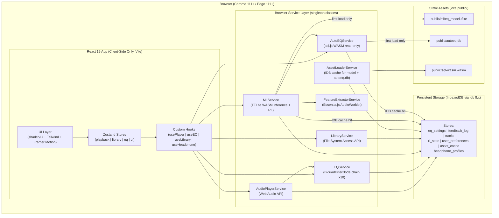
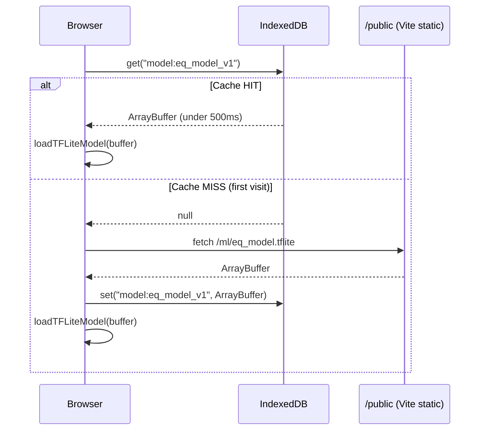
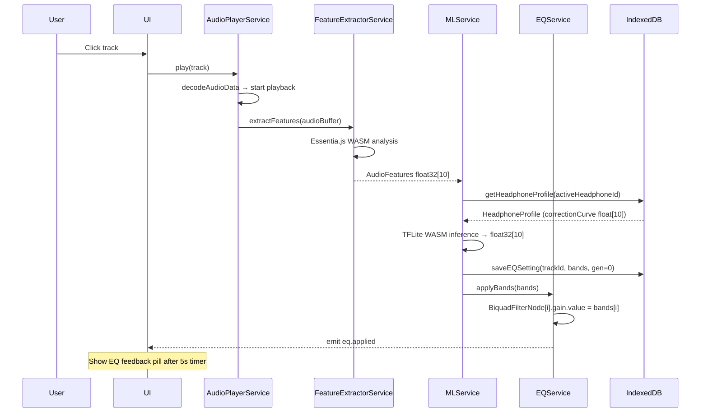
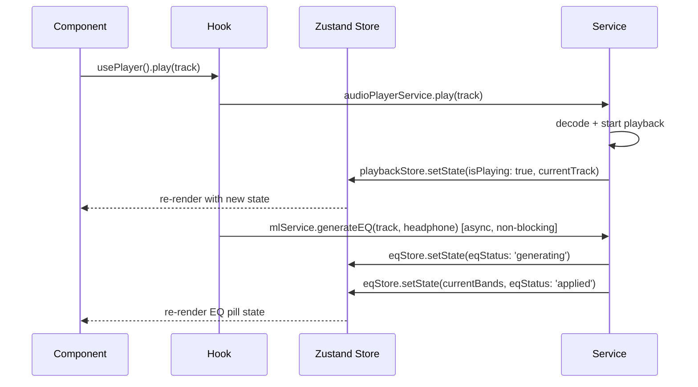

# ARCHITECTURE_WEB.md — Smart EQ Player (Web Version)
**Blueprint Version:** 2.0.0
**Project Name:** Smart EQ Player Web
**Architecture Style:** Client-Side Monolith — WASM-Augmented Browser App
**System Scope:** React + Vite frontend only. Zero backend. Zero network in production after first asset load.

---

## ⚠️ AGENT READING INSTRUCTIONS

You are an AI agent implementing this system. Read every section before writing code.
- ARCHITECTURE.md = what to build and how it connects
- PLAN.md = in what order to build it
- DESIGN.md = how it looks
- AGENTS.md = rules you must follow while coding

**Critical facts:**
1. Zero backend. No API routes. No server of any kind.
2. All ML inference runs in-browser via TFLite WASM.
3. Model cached in IndexedDB after first fetch — never re-downloaded.
4. All audio processing happens in Web Audio API — never in React components.
5. AudioContext MUST be created on user gesture — not on page load.

---

## Architecture Diagram



---

## Model Cache Flow



---

## EQ Generation Dry Run (End-to-End)



---

## Component Responsibility Table

| Component | Responsibility | Supports Scenario |
|---|---|---|
| React Pages/Screens | Render UI, dispatch user events via hooks | All user-facing flows |
| Zustand Stores | App state: playback, library, EQ, UI flags | All stateful interactions |
| Custom Hooks | Bridge between UI and service layer | All feature flows |
| AudioPlayerService | Web Audio API lifecycle, queue, decode, play | Play/pause/skip/seek/queue |
| EQService | BiquadFilterNode chain (10 bands), apply/reset | EQ application, real-time update |
| MLService | TFLite WASM load+cache, inference, RL perturbation | EQ generation, feedback loop |
| FeatureExtractorService | Essentia.js WASM audio analysis | Audio feature extraction |
| LibraryService | File System Access API, file indexing, metadata | Library scan, file re-open |
| AutoEQService | sql.js read-only headphone DB queries | Headphone selection |
| AssetLoaderService | IDB cache management for model + autoeq.db | First-time and cached asset load |
| IndexedDB (idb) | Persist all user data and caches | All persistence scenarios |
| public/ml/eq_model.tflite | Static ML model — fetched once, cached | EQ generation |
| public/autoeq.db | Static AutoEQ DB — fetched once, cached | Headphone profile lookup |

---

## 1. Context Lock

```
Runtime:              Browser (Chrome 111+ / Edge 111+)
Build Tool:           Vite 6.x (NOT Next.js)
Framework:            React 19.x
Language:             TypeScript 5.x (strict mode, eslint enforced)
Package Manager:      npm
Node Version:         20+ (dev only)

--- EXACT VERSIONS (use these, no deviation) ---
react:                        19.x
react-dom:                    19.x
typescript:                   5.x
vite:                         6.x
tailwindcss:                  4.x
@tailwindcss/vite:            4.x
framer-motion:                12.x
zustand:                      5.x
idb:                          8.x
sql.js:                       1.12.x
@tensorflow/tfjs:             4.x
@tensorflow/tfjs-tflite:      latest stable (0.0.1-alpha.10+)
essentia.js:                  0.1.3+
music-metadata-browser:       6.x    (ID3 tag parsing)
clsx:                         2.x
class-variance-authority:     0.7.x  (shadcn/ui dependency)
lucide-react:                 latest (icons)
eslint:                       9.x
vitest:                       3.x
@vitest/coverage-v8:          3.x
@testing-library/react:       16.x
@testing-library/user-event:  14.x

shadcn/ui components (installed via CLI):
  button, input, sheet, dialog, scroll-area, badge,
  separator, skeleton, slider, tooltip, progress, label

--- FORBIDDEN ---
next.js                   (use Vite + React instead)
create-react-app          (dead project)
webpack                   (Vite only)
redux / redux-toolkit     (Zustand only)
react-query               (no server state needed)
axios / ky                (native fetch only)
howler.js / tone.js       (Web Audio API only)
express / fastify         (no backend)
prisma / drizzle          (no backend DB)
firebase / supabase       (no cloud)
jest                      (Vitest only)
@testing-library/jest-dom (use @testing-library/react matchers)

Dependency Direction:
  UI → Hooks → Services → Storage
  NEVER: Services → UI directly
  NEVER: Storage → Services (Services call Storage, not reverse)
  NEVER: UI → Services directly (must go through Hooks)
```

---

## 2. Architectural Boundaries

```
Layers (top to bottom):
  1. UI Layer       — React components, pages, layouts (src/components/, src/pages/)
  2. State Layer    — Zustand stores (src/stores/)
  3. Hook Layer     — Custom hooks, bridge UI ↔ Services (src/hooks/)
  4. Service Layer  — Singleton classes, all business logic (src/services/)
  5. Storage Layer  — IndexedDB schema and operations (src/storage/)
  6. Asset Layer    — Static public files, read-only (public/)

Allowed Call Flow:
  UI → State → Hook → Service → Storage
  Service → Storage (read/write)
  Service → Service via shared utils ONLY (not direct import of another Service class)

Forbidden Call Flow:
  UI → Service directly                  (PROHIBITED)
  Service → React component              (PROHIBITED — emit to Zustand store only)
  Service → another Service class import (PROHIBITED — use shared utils in src/utils/)
  Storage → Service                      (PROHIBITED)
  Component → IndexedDB directly         (PROHIBITED)

Cross-layer Rules:
  RULE-01: ALL audio processing MUST occur in AudioPlayerService. NEVER in React components.
  RULE-02: ALL TFLite inference MUST occur in MLService. NEVER in hooks or components.
  RULE-03: ALL IndexedDB access MUST occur in Service layer or src/storage/ modules.
  RULE-04: EVERY component using browser APIs MUST be a client-side React component (no SSR).
  RULE-05: Audio feature extraction MUST run in AudioWorklet. NEVER on main thread.
  RULE-06: Model and AutoEQ DB MUST be checked in IndexedDB BEFORE any network fetch.
  RULE-07: BiquadFilterNode chain MUST be rebuilt if AudioContext is recreated.
  RULE-08: EQ settings MUST be loaded from IndexedDB BEFORE first audio frame plays.
  RULE-09: ALL service classes MUST be singletons — instantiated once in ServiceProvider.
  RULE-10: Framer Motion animations MUST NOT be applied to audio-processing components.
```

---

## 3. Data Model Contract (IndexedDB)

```
Storage Engine:   IndexedDB via idb 8.x
Database Name:    smart-eq-player-web
Database Version: 1

━━━━━━━━━━━━━━━━━━━━━━━━━━━━━━━━━━━
STORE: tracks
━━━━━━━━━━━━━━━━━━━━━━━━━━━━━━━━━━━
keyPath:      id
id            string      PRIMARY KEY  (SHA256 of fileName + fileSize)
fileName      string      NOT NULL
fileSize      number      NOT NULL
title         string      NOT NULL
artist        string | undefined
album         string | undefined
durationMs    number      NOT NULL
format        'mp3' | 'flac' | 'aac' | 'ogg' | 'wav'
hasEQ         boolean     DEFAULT false
audioFeatures AudioFeatures | null
fileHandle    FileSystemFileHandle | null
addedAt       number      (epoch ms)

INDEXES:
  by-title    on title
  by-artist   on artist
  by-album    on album

━━━━━━━━━━━━━━━━━━━━━━━━━━━━━━━━━━━
STORE: eq_settings
━━━━━━━━━━━━━━━━━━━━━━━━━━━━━━━━━━━
keyPath:      [trackId, headphoneId, generation]  (compound)
trackId       string      NOT NULL
headphoneId   string      NOT NULL
generation    number      NOT NULL  DEFAULT 0
bands         number[]    NOT NULL  (length 10, range [-12, +12])
isDefault     boolean     NOT NULL  DEFAULT false
source        'ml_initial' | 'rl_updated'
createdAt     number

INDEX: by-track-headphone on [trackId, headphoneId]

━━━━━━━━━━━━━━━━━━━━━━━━━━━━━━━━━━━
STORE: feedback_log
━━━━━━━━━━━━━━━━━━━━━━━━━━━━━━━━━━━
keyPath:          id (autoIncrement)
id                number      AUTO
trackId           string      NOT NULL
headphoneId       string      NOT NULL
signal            'like' | 'dislike'
generation        number
listenDurationMs  number
createdAt         number

INDEX: by-track on trackId

━━━━━━━━━━━━━━━━━━━━━━━━━━━━━━━━━━━
STORE: headphone_profiles
━━━━━━━━━━━━━━━━━━━━━━━━━━━━━━━━━━━
keyPath:          id
id                string      PRIMARY KEY  (AutoEQ slug)
name              string      NOT NULL
brand             string      NOT NULL
correctionCurve   number[]    NOT NULL  (length 10)

━━━━━━━━━━━━━━━━━━━━━━━━━━━━━━━━━━━
STORE: user_preferences
━━━━━━━━━━━━━━━━━━━━━━━━━━━━━━━━━━━
keyPath:  key
key       string    PRIMARY KEY
value     unknown

REQUIRED KEYS:
  active_headphone_id     string
  shuffle_mode            boolean
  repeat_mode             'off' | 'one' | 'all'
  onboarding_complete     boolean
  volume                  number (0.0–1.0)

━━━━━━━━━━━━━━━━━━━━━━━━━━━━━━━━━━━
STORE: asset_cache
━━━━━━━━━━━━━━━━━━━━━━━━━━━━━━━━━━━
keyPath:    key
key         string          PRIMARY KEY
data        ArrayBuffer | Uint8Array
cachedAt    number
version     string

REQUIRED KEYS:
  model:eq_model_v1       ArrayBuffer  (eq_model.tflite binary)
  autoeq:db_v1            Uint8Array   (autoeq.db binary)

━━━━━━━━━━━━━━━━━━━━━━━━━━━━━━━━━━━
STORE: rl_state
━━━━━━━━━━━━━━━━━━━━━━━━━━━━━━━━━━━
keyPath:        headphoneId
headphoneId     string    PRIMARY KEY
policyWeights   object
totalFeedback   number    DEFAULT 0
lastUpdated     number
```

---

## 4. Execution Constraints

```
Async Policy:
  RULE-A1: ALL IndexedDB ops MUST use async/await via idb library
  RULE-A2: Audio feature extraction MUST run in AudioWorklet (off main thread)
  RULE-A3: TFLite inference MUST NOT block UI — use async service method
  RULE-A4: Model load from IndexedDB MUST complete before first inference
  RULE-A5: File decoding (AudioContext.decodeAudioData) MUST be awaited before feature extraction
  RULE-A6: sql.js init MUST complete before headphone search is available

Audio Context Policy:
  RULE-AC1: AudioContext MUST be created on first user gesture (click/tap) — NOT on app load
  RULE-AC2: ONE AudioContext instance per session — stored in AudioPlayerService singleton
  RULE-AC3: Chain: AudioBufferSourceNode → filter[0] → ... → filter[9] → GainNode → destination
  RULE-AC4: On track change: disconnect previous source, create new BufferSourceNode — reuse filter chain
  RULE-AC5: AudioContext.resume() MUST be called if state === 'suspended' before playback
  RULE-AC6: GainNode MUST be inserted after filter chain for volume control

Error Handling Policy:
  RULE-E1: TFLite inference failure MUST fall back to headphone correction curve — NOT crash
  RULE-E2: File re-open failure MUST show actionable UI error, NOT crash
  RULE-E3: IndexedDB quota exceeded MUST be caught and surface toast to user
  RULE-E4: sql.js load failure MUST disable headphone selection with error message shown
  RULE-E5: Essentia.js load failure MUST fall back to default features (all 0.5) with console warn
  RULE-E6: Model cache miss MUST trigger re-fetch with visible loading state in UI

Validation Policy:
  RULE-V1: EQ bands MUST have exactly 10 elements before BiquadFilterNode update
  RULE-V2: Each band gain MUST be clamped to [-12.0, +12.0] dB
  RULE-V3: Audio file MUST be validated (audio/* MIME or known extension) before indexing
  RULE-V4: Track ID MUST be non-empty SHA256 string before any EQ operation
  RULE-V5: HeadphoneProfile.correctionCurve MUST have exactly 10 elements before use

Linting Policy:
  RULE-LINT-01: eslint MUST pass with 0 errors before any phase is marked complete
  RULE-LINT-02: TypeScript compiler MUST pass with 0 errors (tsc --noEmit)
  RULE-LINT-03: No 'any' types allowed — use 'unknown' with type guards

Testing Policy:
  RULE-TEST-01: Vitest is the ONLY test runner — no Jest
  RULE-TEST-02: Unit tests MUST be in __tests__/ folders or *.test.ts files co-located
  RULE-TEST-03: Minimum coverage per utility module: 80% branch coverage
  RULE-TEST-04: Integration tests for service layer use fake IndexedDB (fake-indexeddb)
  RULE-TEST-05: Tests MUST pass before any phase is marked complete
```

---

## 5. Integration Contracts

```
Model Cache Contract:
  KEY:      "model:eq_model_v1"
  VALUE:    ArrayBuffer of eq_model.tflite
  VERSION:  "v1" — increment key suffix when model is retrained
  STRATEGY: Check IDB → HIT: load from buffer | MISS: fetch /ml/eq_model.tflite → store → load
  RULE:     NEVER fetch model on every app load

AutoEQ DB Cache Contract:
  KEY:      "autoeq:db_v1"
  VALUE:    Uint8Array of autoeq.db
  STRATEGY: Same as model cache
  RULE:     sql.js MUST receive Uint8Array — NOT ArrayBuffer directly

BiquadFilter EQ Contract:
  Count:     EXACTLY 10 BiquadFilterNode instances, type = "peaking"
  Frequency: [60, 150, 400, 1000, 2500, 4000, 6300, 10000, 14000, 16000] Hz
  Q value:   1.41 (fixed)
  Gain:      Set from EQ bands array — clamped to [-12, +12] dB
  Chain:     AudioBufferSourceNode → filter[0] → ... → filter[9] → GainNode → destination

TFLite WASM Contract:
  Input:     Float32Array length 20 (10 audio features + 10 headphone correction)
  Output:    Float32Array length 10 (EQ band gains in dB)
  Load API:  loadTFLiteModel(buffer: ArrayBuffer) from @tensorflow/tfjs-tflite
  Inference: model.predict(tf.tensor2d([inputArray], [1, 20]))
  REQUIRED:  Dispose tensors after EVERY inference call

File Identity Contract:
  Track ID = SHA256(fileName + fileSize.toString()) via Web Crypto API
  NEVER use full file content hash

RL Perturbation Contract:
  function getPerturbationMagnitude(generation: number): number {
    if (generation <= 0) return 2.0
    if (generation === 1) return 1.5
    if (generation === 2) return 1.0
    return 0.5  // floor
  }
  Direction: biased by headphone correction curve sign

Security Contract:
  RULE-S1: App MUST NOT make network requests after initial asset load
  RULE-S2: No user data transmitted anywhere — all IndexedDB local
  RULE-S3: FileSystemFileHandle permissions MUST be re-requested if expired
  RULE-S4: vite.config.ts MUST include COOP/COEP headers for WASM SharedArrayBuffer
```

---

## 6. Verification Rules

```
Acceptance Scenarios:

SCENARIO-01: Model cached after first load
  GIVEN: First app visit (IndexedDB empty)
  WHEN:  App initializes
  THEN:  eq_model.tflite fetched once, stored in IDB under "model:eq_model_v1"
         AND on next load: model reads from IDB, no network fetch

SCENARIO-02: Play unrated track
  GIVEN: Track has no eq_settings in IDB
  WHEN:  User clicks track
  THEN:  Playback starts, features extracted, TFLite inference runs,
         EQ applied before 5s mark, eq_settings saved to IDB

SCENARIO-03: Play previously liked track
  GIVEN: Track has eq_settings with isDefault=true
  WHEN:  User clicks track
  THEN:  Saved EQ loaded from IDB, applied before first audio frame

SCENARIO-04: Dislike → new EQ
  GIVEN: Track playing with EQ applied
  WHEN:  User clicks Dislike
  THEN:  New EQ generated (generation+1), applied within 3s,
         feedback_log entry created in IDB

SCENARIO-05: App reopen
  GIVEN: User added files in previous session
  WHEN:  App opened again
  THEN:  Library metadata restored from IDB, model loaded from IDB (no network)

Failure Scenarios:

FAIL-01: AudioContext blocked (no user gesture)
  EXPECTED: AudioContext created on first click only — never on page load

FAIL-02: File permission expired
  EXPECTED: UI shows "Re-select file" — no crash

FAIL-03: IndexedDB unavailable (private browsing)
  EXPECTED: App works in-session — banner shows "Storage unavailable"

FAIL-04: TFLite WASM init fails
  EXPECTED: Fallback to headphone correction curve — player still works

Non-Goals (Out of Scope):
  Any backend or server
  SSR of any player logic
  Multi-user / auth
  Cloud sync
  iOS Safari support
  Playlist management (post-MVP)
  Album / artist view (post-MVP)
  PWA / service worker (post-MVP)
```

---

## Project Structure

```
smart-eq-player-web/
├── public/
│   ├── ml/
│   │   └── eq_model.tflite
│   ├── autoeq.db
│   └── sql-wasm.wasm              ← copy from node_modules/sql.js/dist/
├── src/
│   ├── main.tsx                   ← Vite entry point, wrap with ServiceProvider
│   ├── App.tsx                    ← root layout, routing
│   ├── vite-env.d.ts
│   ├── components/
│   │   ├── ui/                    ← shadcn/ui generated (do not edit manually)
│   │   ├── TrackListItem.tsx
│   │   ├── NowPlayingPanel.tsx
│   │   ├── EQFeedbackPill.tsx
│   │   ├── MiniPlayer.tsx
│   │   ├── HeadphoneSelector.tsx
│   │   ├── LibraryEmpty.tsx
│   │   ├── SkeletonTrack.tsx
│   │   └── AppInitLoader.tsx      ← loading screen during ServiceProvider init
│   ├── pages/
│   │   ├── LibraryPage.tsx
│   │   └── SettingsPage.tsx       ← headphone change, rescan, app info
│   ├── hooks/
│   │   ├── usePlayer.ts
│   │   ├── useLibrary.ts
│   │   ├── useEQ.ts
│   │   └── useHeadphone.ts
│   ├── services/
│   │   ├── AssetLoaderService.ts
│   │   ├── AudioPlayerService.ts
│   │   ├── EQService.ts
│   │   ├── MLService.ts
│   │   ├── FeatureExtractorService.ts
│   │   ├── LibraryService.ts
│   │   └── AutoEQService.ts
│   ├── stores/
│   │   ├── playbackStore.ts
│   │   ├── libraryStore.ts
│   │   ├── eqStore.ts
│   │   └── uiStore.ts             ← loading states, modal visibility
│   ├── storage/
│   │   ├── db.ts                  ← idb schema + openDB()
│   │   ├── assetCache.ts
│   │   ├── trackStorage.ts
│   │   ├── eqStorage.ts
│   │   ├── feedbackStorage.ts
│   │   ├── preferenceStorage.ts
│   │   └── rlStorage.ts
│   ├── types/
│   │   ├── Track.ts
│   │   ├── EQSetting.ts
│   │   └── HeadphoneProfile.ts
│   ├── utils/
│   │   ├── trackId.ts             ← SHA256(fileName + fileSize)
│   │   └── eqMath.ts              ← clamp, perturbation, normalize
│   └── providers/
│       └── ServiceProvider.tsx    ← singleton init, shows AppInitLoader
├── vite.config.ts                 ← COOP/COEP headers, asyncWebAssembly
├── tailwind.config.ts
├── tsconfig.json                  ← strict: true
├── eslint.config.ts               ← eslint 9.x flat config
├── vitest.config.ts
└── package.json
```

---

## vite.config.ts Required Setup

```typescript
// vite.config.ts — REQUIRED, do not remove any of these
import { defineConfig } from 'vite'
import react from '@vitejs/plugin-react'
import tailwindcss from '@tailwindcss/vite'
import path from 'path'

export default defineConfig({
  plugins: [react(), tailwindcss()],
  resolve: {
    alias: { '@': path.resolve(__dirname, './src') },
  },
  server: {
    headers: {
      'Cross-Origin-Opener-Policy': 'same-origin',
      'Cross-Origin-Embedder-Policy': 'require-corp',
    },
  },
  optimizeDeps: {
    exclude: ['sql.js'],  // sql.js must not be pre-bundled — it self-loads its WASM
  },
  build: {
    target: 'esnext',  // required for top-level await and WASM
  },
})
```

---

## Internal Contract: Front-End ↔ Service Communication



```typescript
// Event contract — Services emit to Zustand, NEVER to React directly
// Services call store.setState() imported from the Zustand store module
// Components subscribe via useStore() hooks — passive, no direct service calls

// Error contract — all service public methods must have this shape:
type ServiceResult<T> =
  | { ok: true; data: T }
  | { ok: false; error: string }

// EQ bands contract (used everywhere)
type EQBands = number[] // ALWAYS length 10, range [-12, +12]

// Track identity
type TrackId = string // SHA256 result, non-empty
```
